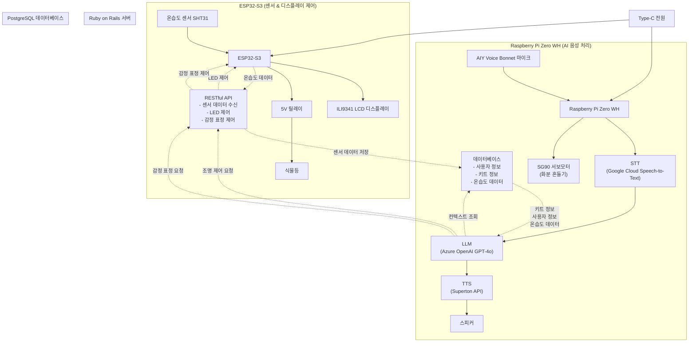

# chytonpide-embedded 🌱

## 🔧 하드웨어 구성

| 구성 요소           | 기능              | 사용자 가치            | 처리 플랫폼       |
| ------------------- | ----------------- | ---------------------- | ----------------- |
| 🖥️ MCU (ESP32-S3)   | 제어 및 통신      | 자동화·데이터 처리     | ESP32-S3          |
| 📡 Wi-Fi 모듈       | 서버 통신         | 실시간 데이터 처리     | ESP32-S3          |
| 🌡️ 온습도 센서      | 환경 실시간 측정  | 식물 상태 정확한 진단  | ESP32-S3          |
| 🖥️ LCD 디스플레이   | 표정/상태 출력    | 시각적 피드백          | ESP32-S3          |
| 💡 식물등           | 자동 광합성 조절  | 무관심 상태에서도 유지 | ESP32-S3          |
| ⚙️ 모터             | 감정 표현, 움직임 | 생동감, 교감           | Raspberry Pi Zero |
| 🎤 마이크/스피커    | 음성 상호작용     | 친근감, 접근성         | Raspberry Pi Zero |
| 🏠 3D 프린터 하우징 | 구조 및 방수      | 관리 편의, 디자인      | -                 |

> **하이브리드 아키텍처**: **ESP32-S3** (센서/디스플레이 제어) + **Raspberry Pi Zero WH** (AI 음성 처리/모터 제어)

### ESP32-S3 기반 구성 요소

-   🌡️ **SHT31 온습도 센서**

    -   고정밀 센서(±2%RH, ±0.3°C).
    -   DHT11보다 빠르고 안정적이며 장시간 제품 운용에 적합.
    -   식물의 성장 환경 분석을 위해 높은 정확도 필요.
    -   주기적으로 서버에 데이터 업로드 (30초 간격).

-   🖥️ **ILI9341 LCD (SPI)**

    -   표정 표시 / 상태 안내 / 환경 정보 시각화
    -   사용자 음성 입력에 따라 다양한 감정 표정 표현 (HAPPY, SAD, ANGRY, SURPRISED, TIRED, CALM 등)
    -   서버 API를 통한 원격 감정 상태 제어

-   💡 **릴레이 기반 식물등 제어**

    -   서버 API를 통한 원격 제어
    -   사용자 음성 명령에 따라 자동 켜기/끄기

-   🔌 **Type-C 충전 모듈**
    -   어떤 환경에서도 안정적 전원 공급
    -   사용자에게 친숙한 USB-C 포트 채택

### Raspberry Pi Zero WH 기반 구성 요소

-   🎤 **Google AIY Voice Bonnet**

    -   전용 마이크 어레이 및 오디오 처리
    -   Google Cloud Speech-to-Text API 연동
    -   자동 VAD (Voice Activity Detection) 내장

-   🔊 **스피커 출력**

    -   AIY Voice Bonnet 내장 오디오 출력
    -   SuperTone TTS API를 통한 고품질 음성 합성

-   ⚙️ **SG90 서보모터**
    -   Google AIY Voice Bonnet GPIO Expansion Pins 활용 (PIN_A, PIN_B, PIN_C, PIN_D)
    -   AI 응답 시 화분을 흔들어 생동감 표현
    -   치피 음성과 동시에 움직임 연출

## 🏗️ 아키텍처



## 🤖 AI 음성 상호작용

### 음성 처리 파이프라인

```
음성 입력 (AIY Voice Bonnet 마이크)
  → STT (Google Cloud Speech-to-Text API)
    → 트리거 단어 감지 (선택적)
      → LLM (Azure OpenAI GPT-4o)
        → 컨텍스트 주입 (DB: 사용자 정보, 키트 정보, 온습도 데이터)
          → 응답 생성
            → 감정 감지 (키워드 기반)
              → TTS (Superton API)
                → 음성 출력 (스피커)
                → 서보 모터 실행 (화분 흔들기)
                → 서버 API 호출 (LCD 감정 표정 업데이트, LED 제어)
```

### 주요 기능

-   🎯 **스마트 인식**: Google Cloud Speech-to-Text의 자동 VAD 및 힌트 구문 지원으로 짧은 명령도 정확히 인식
-   🧠 **컨텍스트 기반 대화**: 데이터베이스에서 사용자 정보, 키트 정보, 최신 온습도 데이터를 가져와 맞춤형 응답
-   😊 **감정 표현**: LLM 응답의 키워드를 분석하여 LCD에 감정 표정 표시 (HAPPY, SAD, ANGRY, SURPRISED, TIRED, CALM)
-   ⚙️ **모터 반응**: AI 응답 시 자동으로 서보 모터가 화분을 흔들어 생동감 표현
-   💡 **조명 제어**: "조명 켜줘", "불 꺼줘" 같은 음성 명령으로 식물등 제어
-   🔄 **트리거 단어 (선택적)**: 환경 변수로 활성화/비활성화 가능 ("치피야" 등)
-   😴 **Sleep/Wake 모드**: 일정 시간 말이 없으면 Sleep 모드로 전환하여 전력 절약

### LLM 컨텍스트 관리

-   **사용자 정보**: 데이터베이스에서 사용자 이름, 키트 정보 조회
-   **센서 데이터**: 최신 온습도 데이터 및 추세 분석
-   **최근 활동**: 사용자의 최근 활동 로그 (물 주기 등)
-   **동적 프롬프트**: 사용자 질문에 따라 특별 컨텍스트 주입
    -   온도/습도 질문 시: 센서 데이터 자동 포함
    -   상태 질문 시: 온습도 데이터 + 식물 상태 판단
    -   인사/감정 표현 시: 맞춤형 응답 가이드

## 📊 센서 데이터 적재 방식

-   온습도 센싱 데이터 → 1초 단위 로컬 버퍼링 → 30초 평균값 업로드
-   Wi-Fi가 끊기면 버퍼에 저장 후 연결 회복 시 묶어서 전송(batch)
-   PostgreSQL 데이터베이스에 저장되어 AI 컨텍스트로 활용

## 📁 프로젝트 구조

```
chytonpide/
├── src/
│   ├── firmware/              # ESP32-S3 펌웨어
│   │   ├── firmware.ino
│   │   ├── SensorManager.h/cpp      # 센서 데이터 관리
│   │   ├── RelayLedController.h/cpp # LED 제어
│   │   ├── FaceEmotionController.h/cpp # 감정 제어
│   │   ├── RoboEyesTFT_eSPI.h      # LCD 감정 표현
│   │   └── ...
│   ├── server/                 # Python Test용 서버 (FastAPI)
│   │   ├── main.py
│   │   ├── API.md
│   │   └── requirements.txt
│   ├── ai-voice/               # Raspberry Pi 음성 처리
│   │   ├── main_google-stt_aoai-llm_superton-tts.py
│   │   ├── core/
│   │   │   └── chipi_brain.py  # LLM 컨텍스트 관리
│   │   ├── database/
│   │   │   └── db_manager.py   # DB 연동
│   │   ├── servo/              # 서보 모터 제어
│   │   │   ├── controller.py
│   │   │   └── examples/
│   │   ├── utils/
│   │   │   ├── audio_utils.py  # 오디오 재생
│   │   │   └── tts_gen.py      # TTS 파일 생성 유틸리티
│   │   └── config/
│   │       └── .env
│   └── database/               # 데이터베이스 연동
│       └── ...
└── README.md
```

## 🚀 주요 특징

### 1. 하이브리드 아키텍처

-   **ESP32-S3**: 실시간 센서 데이터 수집 및 디스플레이 제어 (저전력, 빠른 응답)
-   **Raspberry Pi Zero WH**: 고급 AI 음성 처리 및 모터 제어 (유연성, 확장성)

### 2. 스마트 음성 상호작용

-   Google Cloud Speech-to-Text의 자동 VAD로 시끄러운 환경에서도 안정적 인식
-   힌트 구문 지원으로 자주 사용하는 명령어 인식률 향상

### 3. 컨텍스트 인식 AI

-   데이터베이스를 통한 실시간 컨텍스트 주입
-   사용자별 맞춤형 대화
-   식물 상태 기반 스마트 응답

### 4. 다중 감각 피드백

-   음성 응답 (TTS)
-   시각적 피드백 (LCD 감정 표정)
-   물리적 피드백 (서보 모터 움직임)
-   조명 제어 (식물등)

## 🔧 기술 스택

### ESP32-S3

-   **프레임워크**: Arduino Core for ESP32
-   **센서**: SHT31 (I2C)
-   **디스플레이**: ILI9341 TFT LCD (SPI)
-   **통신**: Wi-Fi, HTTP/REST API

### Raspberry Pi Zero WH

-   **OS**: Raspberry Pi OS
-   **하드웨어**: Google AIY Voice Bonnet
-   **언어**: Python 3.7+
-   **STT**: Google Cloud Speech-to-Text API
-   **LLM**: Azure OpenAI GPT-4o
-   **TTS**: Superton API
-   **모터 제어**: gpiozero, aiy.pins

## 🚀 향후 개발 계획

### 1. 하드웨어 및 센서 융합

#### 멀티 센서 통합 시스템

-   **조도 센서**: 일조량 모니터링 및 식물등 자동 제어 최적화
-   **온습도 센서 (현재 SHT31)**: 고정밀 환경 측정 강화
-   **수위 센서**: 화분 토양 수분량 실시간 모니터링 및 자동 급수 시스템 연동
-   **카메라**: 식물 성장 과정 시각적 추적, 이상 징후 시각 분석
-   **PIR 인체 감지 센서**: 사용자 접근 시 능동적으로 반응하는 시스템 구축
-   **목표**: 모든 센서 데이터를 융합하여 식물의 생육 환경을 정밀하게 모니터링하고, 사용자 접근 시 먼저 반응하는 능동형 하드웨어 시스템 구축

#### 스마트홈 플랫폼 연동

-   **KT 기가지니 연동**: 기존 스마트홈 서비스와 결합
-   **가정 내 허브 기기로 확장**: 다른 IoT 기기와 연동하여 통합 제어
-   **목표**: 단순 식물 관리 장치를 넘어 가정 내 중심 허브 기기로 확장

### 2. 사용자 경험 혁신

#### 능동적 상호작용 구현

-   **GPS 위치 기반**: 사용자 위치를 감지하여 집에 돌아왔을 때 먼저 인사
-   **도어락 작동 감지**: 출입문 개폐 신호를 받아 사용자 접근 시 능동적으로 반응
-   **터치 신호 감지**: 화분이나 디바이스 터치 시 즉각적인 반응
-   **목표**: AI가 사용자에게 먼저 말을 건네는 능동형 서비스 제공

#### 위험 상황 예측 알림

-   **센서 데이터 분석 강화**: 현재 온습도 데이터뿐만 아니라 다양한 센서 데이터 종합 분석
-   **이상 징후 사전 포착**: 식물의 건강 상태 변화를 조기에 감지
-   **실시간 경고 시스템**: 문제 발생 시 즉시 사용자에게 알림
-   **목표**: 단순 데이터 기록을 넘어서 **센서 기반 이상 탐지 (Anomaly Detection)** 기능을 추가하여 반려식물의 문제 상황을 자동으로 식별. 이를 통해 사용자는 식물 관리에 신경 쓰지 않아도 문제가 발생했을 때 즉시 알림을 받을 수 있으며, 제품의 총체적인 지능도 한 단계 향상

#### 교감형 인터페이스 구축

-   **물리적 접촉 감지**: 식물을 쓰다듬거나 화분을 만지는 터치 감지
-   **실감 나는 상호작용**: 접촉 신호에 따른 즉각적인 반응 (LCD 표정 변화, 모터 움직임, 음성 응답)
-   **목표**: 단방향 명령이 아닌 쌍방향 교감을 통한 감성적 연결 강화

### 3. 소프트웨어 개선

-   **사용자 커스텀 음성 명령 추가**: 개인화된 음성 명령어 학습 및 인식
-   **더 많은 감정 표현 및 애니메이션**: LCD 표정의 다양성 확대 및 부드러운 전환 애니메이션
-   **모터 움직임 패턴 다양화**: 상황별 맞춤형 모터 움직임 패턴 구현
-   **머신러닝 기반 학습**: 사용자 패턴 학습을 통한 개인화된 응답 및 예측
