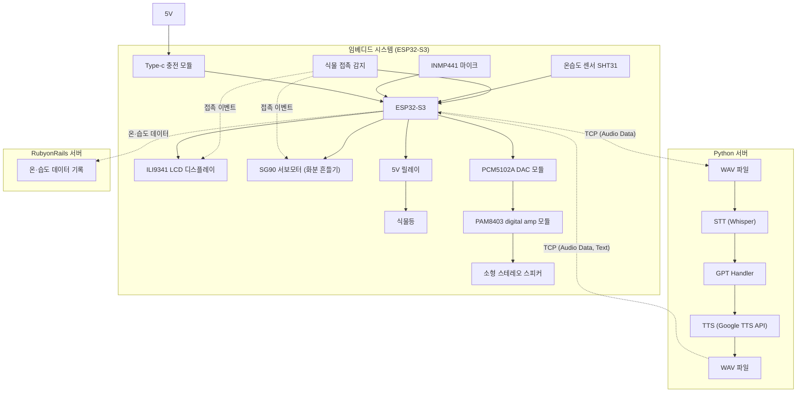

# chytonpide-embedded 🌱

## 🔧 하드웨어 구성

| 구성 요소           | 기능              | 사용자 가치            |
| ------------------- | ----------------- | ---------------------- |
| 🖥️ MCU              | 제어 및 통신      | 자동화·데이터 처리     |
| 📡 Wi-Fi 모듈       | 서버 통신         | 실시간 데이터 처리     |
| 🌡️ 온습도 센서      | 환경 실시간 측정  | 식물 상태 정확한 진단  |
| 👆 터치 감지 센서   | 식물 접촉 감지    | 교감 경험 제공         |
| 🖥️ LCD 디스플레이   | 표정/상태 출력    | 시각적 피드백          |
| ⚙️ 모터             | 감정 표현, 움직임 | 생동감, 교감           |
| 🎤 마이크/스피커    | 음성 상호작용     | 친근감, 접근성         |
| 💡 식물등           | 자동 광합성 조절  | 무관심 상태에서도 유지 |
| 🏠 3D 프린터 하우징 | 구조 및 방수      | 관리 편의, 디자인      |

> **전력 효율·비용·오디오 지원·GPIO 구성·실시간성**을 균형 있게 갖춘 **ESP32-S3**를 임베디드 MCU로 채택

-   🌡️ **SHT31 온습도 센서**
    -   고정밀 센서(±2%RH, ±0.3°C).
    -   DHT11보다 빠르고 안정적이며 장시간 제품 운용에 적합.
    -   식물의 성장 환경 분석을 위해 높은 정확도 필요.
-   👆 **식물 접촉 감지 센서**
    -   사용자가 잎을 만지는 순간을 감지 → 캐릭터 반응(표정/모션) 트리거.
    -   단순 데이터 로깅을 넘어 '교감'이라는 정서적 경험을 제공.
-   🎤 **INMP441 디지털 마이크 (I2S)**
    -   잡음에 강하고 ESP32-S3와 직접 I2S 연결 가능.
    -   센서 노이즈, ADC 변환 오류를 줄여 **STT 품질 개선**.
-   🔊 **PCM5102A DAC → PAM8403 증폭기 → 스테레오 스피커**
    -   DAC에서 고품질 음성 출력 → 스피커로 출력.
    -   내장 DAC 대신 외부 DAC을 선택한 이유:
        -   ESP32의 내장 DAC는 8비트/잡음 심함
        -   외부 DAC은 24비트 고품질 오디오 출력 가능.
-   🖥️ **ILI9341 LCD (SPI)**
    -   표정 표시 / 상태 안내 / 환경 정보 시각화
    -   시각적 피드백은 사용자 경험에 매우 중요
-   ⚙️ **SG90 서보모터**
    -   식물이 기분 좋을 때 흔들리는 듯한 모션 연출
    -   단순 장식이 아니라 '감정 표현' 기능
-   🔌 **Type-C 충전 모듈**
    -   어떤 환경에서도 안정적 전원 공급
    -   사용자에게 친숙한 USB-C 포트 채택
-   🏠 **3D 프린터 하우징**
    -   방수/방진 설계 가능
    -   내부 공간 최적화하여 안정적인 부품 배치
    -   브랜드 아이덴티티 반영한 디자인 제작 가능

## ⚡ 회로도

## 🏗️ 아키텍처

## 📊 **센서 데이터 적재 방식**

-   온습도 센싱 데이터 → 1초 단위 로컬 버퍼링 → 1분 평균값만 업로드
-   Wi-Fi가 끊기면 버퍼에 저장 후 연결 회복 시 묶어서 전송(batch)

## 🎤 **음성 상호 작용**

-   **단기(**비용 효율적**)**: Whisper(무료, 로컬 실행) + Google TTS(무료)
-   **중기**(확장성, 품질): Azure Speech Services 도입
-   **장기**(도메인 특화): Custom Speech 모델

## 🚀 **추후 기능: 센서 데이터 이상 탐지(Anomaly Detection)**

향후에는 단순 데이터 기록을 넘어서 **센서 기반 이상 탐지 기능**을 추가하여 반려식물의 문제 상황을 자동으로 식별할 예정이다. 이를 통해 사용자는 식물 관리에 신경 쓰지 않아도 문제가 발생했을 때 즉시 알림을 받을 수 있으며, 제품의 총체적인 지능도 한 단계 향상된다.

즉, 이 기능을 추가함으로써 **사용자 편의성(알림), 기기 안정성, 장기적 지능화** 모두 확보할 수 있으며, 제품의 완성도를 크게 높이게 된다.
